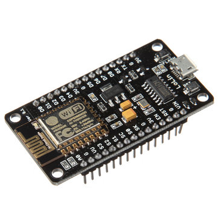
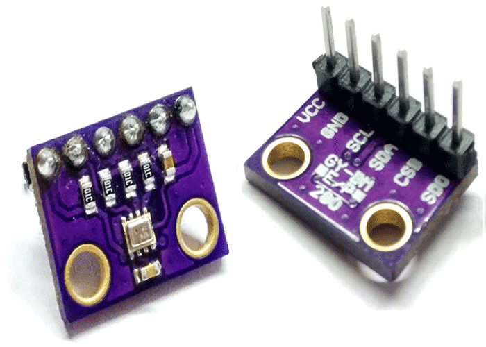
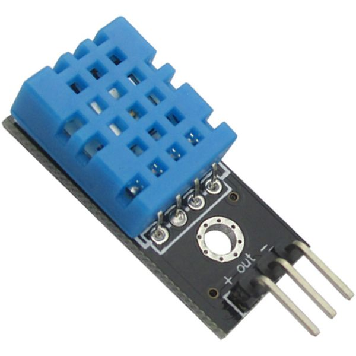
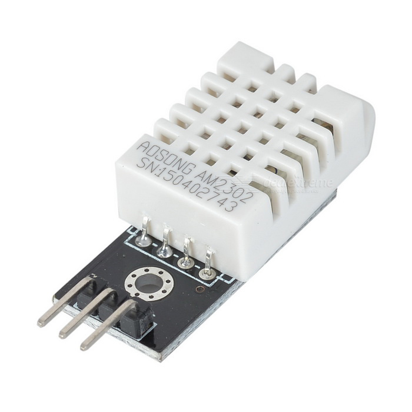
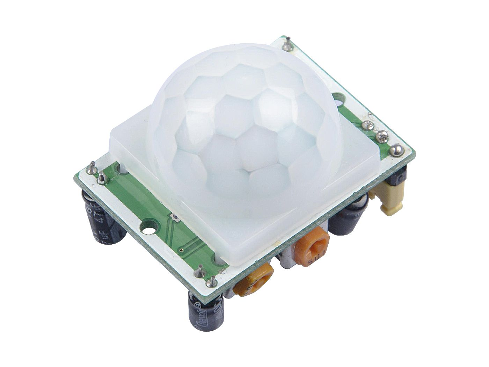
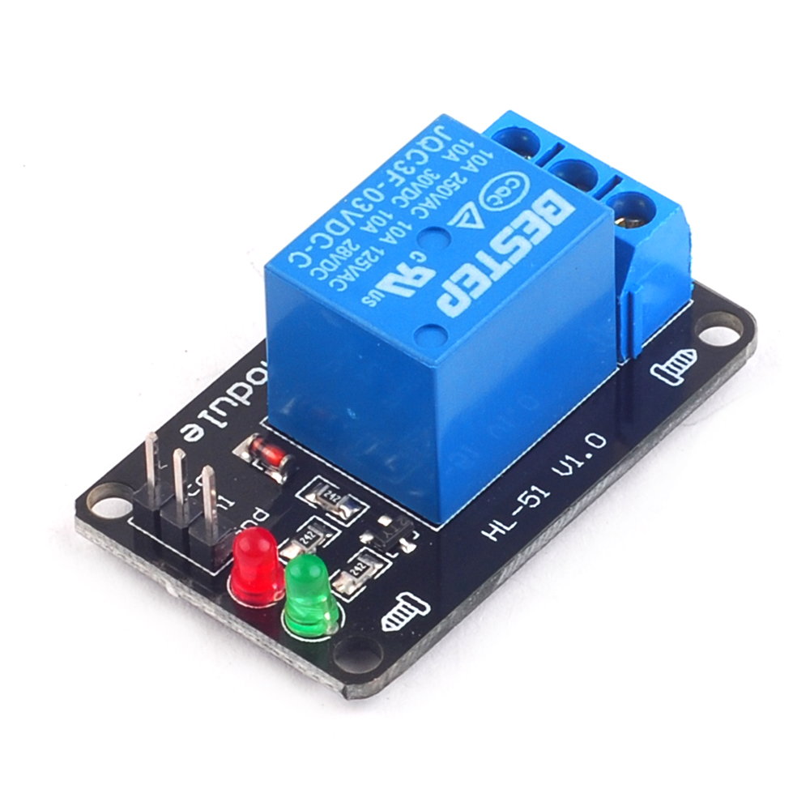
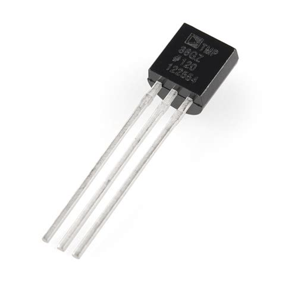

# AthosIoT – Technical Brief

## Document Overview

This document is intended to outline the various software and hardware components of the AthosIoT system.  We will start with an overview of the architecture and then dive into the major components and their details one by one.

**Build Status**    
    

**Source Control Details**    
1. [Code Of Conduct](https://github.com/nothingmn/AthosIoT/blob/master/CODE_OF_CONDUCT.md)  
1. [Contributing](https://github.com/nothingmn/AthosIoT/blob/master/CONTRIBUTING.md)  
1. [License](https://github.com/nothingmn/AthosIoT/blob/master/LICENSE)  
1. [Bug reports, feature requests](https://github.com/nothingmn/AthosIoT/issues/new/choose)  
1. [Build status](https://github.com/nothingmn/AthosIoT/actions?query=workflow%3A%22Main+Build%22)  
  
----  
  
## Table of Contents  
1. [General Architecture](#general-architecture)  
   1.1 [Overview](#overview)  
   1.2 [Target Audience](#target-audience)  
  
2. [AthosIoT Hub](#athosiot-hub)  
2.1.	[RaspberryPi 4](#raspberrypi-4)  
2.1.1.		[Primary purpose and usage](#primary-purpose-and-usage")  
2.1.2.		[Getting setup](#getting-setup)  
2.1.2.1.			[Download Image, 16GB card needed](#download-image-16gb-card-needed)  
2.1.2.2.			[Tools for formatting the SD Card](#tools-for-formatting-the-sd-card)  
2.1.2.3.			[Tools for writing the image onto the SD Card](#tools-for-writing-the-image-onto-the-sd-card)  
2.1.3.		[File locations:](#file-locations)  
2.1.3.1.			[Ssh-keys for github (AthosIoT.Web)](#ssh-keys-for-github-athosiotweb)  
2.1.3.2.			[Authorized keys file](#authorized-keys-file)  
2.1.3.3.			[Athos.service file](#athosservice-file)  
2.1.3.4.			[Node-Red settings, temp device storage and global context files](#node-red-settings-temp-device-storage-and-global-context-files)  
2.1.3.5.			[Node-red service file](#node-red-service-file)  
2.1.3.6.			[RaspAP config file](#raspap-config-file)  
2.1.3.7.			[MQTT Configuration](#mqtt-configuration)  
  
3.	[Node-Red](#node-red)  
3.1.		[Why Node-Red vs build your own](#why-node-red-vs-build-your-own)  
3.1.1.           [Basic flows](#basic-flows)  
3.2.		[How to add backup to your instance](#how-to-add-backup-to-your-instance)  
3.3.		[How to change the username/password](#how-to-change-the-usernamepassword)  
3.4.		[Adding your own flows](#adding-your-own-flows)  
3.4.1.			[Your own Node-Red instance, and MQTT](#your-own-node-red-instance-and-mqtt)  
3.4.2.			[Useful flows](#useful-flows)  
  
4.	[MQTT](#mqtt)  
4.1.		[Why are we using it, what function does it perform?](#why-are-we-using-it-what-function-does-it-perform)  
4.2.		[How to change the username/password](#how-to-change-the-usernamepassword-1)  
4.3.		[List of topics, what they are for](#list-of-topics-what-they-are-for)  
  
5.	[RaspAP](#raspap)  
5.1.		[Why are we using it, what function does it perform?](#why-are-we-using-it-what-function-does-it-perform-1)  
5.2.		[How to change the username/password](#how-to-change-the-usernamepassword-2)  
  
6.	[AthosIoT.Web](#athosiotweb)  
6.1.		[WebSocket, and tie in with node-red](#websocket-and-tie-in-with-node-red)  
6.2.		[An overview of the user interface](#an-overview-of-the-user-interface)  
  
7.	[Enclosures](#enclosures)  
7.1		[Raspberry PI](#raspberry-pi)  
7.2		[NodeMCU](#nodemcu)  
  
8.	[OTA process](#ota-process)  
8.1.	[How to trigger the OTA update](#how-to-trigger-the-ota-update)  
8.2		[Web Server](#web-server)  
  
1. [AthosIoT Nodes](#athosiot-nodes)  
9.1.    [General design](#general-design)  
9.2.        [Boot process](#boot-process)  
9.3.        [Getting VSCode setup correctly](#getting-vscode-setup-correctly)  
9.4.        [Using tasks to target builds](#using-tasks-to-target-builds)  
9.5.        [Hardware](#hardware)  
9.5.1.            [ESP8266 and Variants](#esp8266-and-variants)  
9.5.2.                [NodeMCU](#nodemcu-1)  
9.5.3.                [Wemos D1](#wemos-d1)  
9.6.            [Parts List of Sensors / Actuator](#parts-list-of-sensors-actuator)  
9.7.    	[Global Actions](#global-actions)  
9.7.1.	    	[Reset, Wipe, Ping, etc](#reset-wipe-ping-etc)  
----  
  
## General Architecture  
  
### Overview  
The AthosIoT project was designed for small to medium sized project installations, with no explicit limitations on the number of nodes you can add to your network.  Generally speaking all when we refer to “Hub” or “Master” it means the Raspberry PI where “Node” or “Slave” refers to any of the ESP8266 devices on the network.  
  
One of the bigger goals for the Hub was to leverage as much open source projects as we could in order to simplify the solution and management of.  We wanted to be able to leverage those projects existing documentation and ecosystem in order to jump-start the progress of this project.  For example, instead of writing our own logic to implement a Hidden Access Point in the Hub, we leverage RaspAP and have it turned on by default. (We will explain this in more detail below).  The point is, is that by leveraging all the hard work by the RaspAP team, after a basic setup and configuration of that tool, we can simply mark that task as done with and move on to more important details.  
  
We chose a Raspberry Pi 4 for our hub simply because it was the most powerful Raspberry Pi 4 on the market at the time of this projects creation.  It brings more then enough CPU power and Network bandwidth for our needs.  Not to mention the community and ecosystem is huge and well cared for.  Kudos the the Raspberry Pi team and communities for such a great job.
  
Our Hub is the brains of the entire project, and within that, we rely heavily on the Node-Red open source project.  This means with very little knowledge of JavaScript the average consumer should be able to manage their own installation with ease.  That ecosystem is also flourishing and mature enough to be depended upon.  We will get into more details about our flows within node-red further on.
  
Our basic goal for our Nodes were one of simplicity.  That is, we try to keep any and all logic off of those devices as much as possible.  The less code we have the easier they will be to manage, keep up to date and grow.  We understand the difficulty in the sheer variety of options people will want for their nodes (different sensors, actuators, etc..) and instead of creating a configuration and deployment system we have opted for a much smaller and controlled set of Nodes + Sensors/Actuators and a set of pre-defined builds.  If you need more variety, feel free to enhance the Build.sh, vscode tasks.json, platform.ini, and github actions in the form of a pull request.
  
The final piece to mention here is that we went out of our way to automate the setup and configuration of our nodes, details are provided in the AthosIoT Nodes section, but the high-level overview of that process is this.  Our goal was to not have any human interaction with our Nodes in order to get them setup and on the network.  Essentially plug and play.  We facilitate this by having an hidden Access Point on the Hub which is well known (and hard coded) to the Nodes.  If the Nodes fail to connect to their configured AP (or it has not been configured yet) they will attempt to connect to this hidden network.  Once connected they will attempt to retrieve the configuration either by HTTP or UDP.  Once configured, they reset and during the boot they connect to the desired AP, MQTT and so on.  This allows for a very fault tolerant network which the administrator can feel free to OTA (Over The Air update) and / or wipe device’s memory with little to no repercussions.  They will simply follow that bootstrapping process again and reconnect.  The only real way to take one of these nodes out of commission will be to unplug it.  Uptime is very important.
  
### Target Audience
As you can tell we tried to make the installation and management of this entire project very easy, with UI’s where appropriate.  This makes the project very consumable by non-hard-core engineers.  You don’t have to have a degree in electronics engineering or even be a seasoned developer to install, setup, grow and manage your own IoT system.
  
## AthosIoT Hub  
As mentioned above this is the brains of the outfit.  In this section we will cover of the hub from end to end.    
###	RaspberryPi 4  
The hardware runs on a Raspberry Pi4.  The Pi4 provides us with more than enough processing power and bandwidth.    
####		Primary purpose and usage  
The primary purpose of our Hub is to provide system level flows of Sensor and Actuator messages, and to act as a Web Server (via a single websocket) for primary communication with the AthosIoT.Web UI documented below.  Typically nothing should be done on the Pi by the end user, and should only be modified by this project team.  This will assist with frictionless updates for future releases.    
####		Getting setup  
Currently we provide a 16GB version of the Rasbian OS, with everything preconfigured.  You will only need to download the image, write it to your 16GB SD Card, plug it in and boot up the RPi device.  From there the final thing you will need to do is use the UI to configure the Wifi for the Nodes.    
#####			Download Image, 16GB card needed  
The SD card image download can be [found here]().  Download it now.    
#####			Tools for formatting the SD Card  
In order to ensure a good clean write onto the SD Card it is recommended that you use the [SDFormatter tool](https://www.sdcard.org/downloads/formatter/) (on windows and mac).  At the time of writing this, the tool allowed you to set an "Option", "Format Size Adjustment".  We recommend that this is turned on.  Use this tool now to format the SD Card and get it ready for our image.  Based on our experience, you may need to hit format twice in order for it to fully format.    
#####			Tools for writing the image onto the SD Card  
On windows we recommend the [Win 32 Disk Imager Tool](https://sourceforge.net/projects/win32diskimager/).   Once the 16GB image has been downloaded, unzip the file.  You should have a .IMG file.  Use the Win 32 Disk Imager tool to WRITE to the newly formatted SD card.    
####		File locations:  
To be thurough we felt it necessary to document all of the important file locations on the SD Card image, they are as follows:    
#####			Ssh-keys for github (AthosIoT.Web)  
Feel free to generate your own SSH key pair by using the ssh-keygen utility.  If you want to download the most recent versions of AthosIoT.Web project you will need to do this.  This should generate your keys located at 

*/home/pi/.ssh/**    

#####			Authorized keys file  
If you need to ssh into the RPi, feel free to add your details to the /home/pi/.ssh/authorized_keys file.  This will help automate your logins.  

The default username and password for the Raspberry Pi image have been left the same since the original Raspbian OS, which are as follows:    
    
*Username: pi*     
*Password: raspbian*    
     
#####			Athos.service file  
The systemctl .service file, which is the service that controls the http web sever which serves up the AthosIoT.Web single page application can be found here:    
    
*/lib/systemd/system/athos.service*    

Stop, start, etc this service by using the following commands:    
    
*> sudo systemctl start athos.service*    
*> sudo systemctl stop athos.service*    
*> sudo systemctl enable athos.service*    
*> sudo systemctl disable athos.service*    
    
And if you make changes to the athos.service file itself, be sure to reload the daemon:    
    
*> sudo systemctl daemon-reload*        
    
#####			Node-Red settings, temp device storage and global context files  
Node-Red has been installed in the user pi's home directory at    
    
*/home/pi/.node-red/*    
    
The primary flows file is:

*/home/pi/.node-red/flows_AthosIotHub.json*    

Any and all changes in the Node-Red UI will change this file.  Second to that, Node-Red will store global.set/global.get data in the following file:    
    
*/home/pi/.node-red/context/global/global.json*    
    
If you are concerned about backing up any changes, these two files are critical.  The global.json file will be the file which your node and relay names are stored, along with the WiFi AP you configure in the UI.    
#####			Node-red service file  
Similar to the athos.service file documented above, the node-red service file can be found here:    

*/lib/systemd/system/nodered.service*    
     
It has been left unchanged since the default installation of the product itself.
    
Node-Red also comes with a settings.js file, which is located here:
    
*/home/pi/.node-red/settings.js*
    
The only changes we made to this file was the enable CORS in order to allow for our UI and Node-Red (WebSocket) to be on different ports on the same host.  A different port is still considered a Cross Origin Request.  The second change as made to secure the UI admin page (and not the API).
    
If you wanted to change the node-red with a username/password, the instructions are in the file itself and are well documented online.   
    
The currently configured username and password are as follows:
    
*Username: admin*     
*Password: 88888888*    
         
#####			RaspAP config file  
Please consider the [project page for RaspAP project](https://raspap.com/) and [GitHub](https://github.com/billz/raspap-webgui) for more details.

#####			MQTT Configuration  
We have installed MQTT, with an out of the box configuration and have NOT enabled a username/password.  It is hosted on the default port of 1883, and does NOT have TLS or any other security implemented.
     
Please consider NOT ever exposing this instance of MQTT outside of your protected network.  It was only meant for internal AthosIoT Hub usage.
    
###	Node-Red  
As we mentioned above Node-Red is the brains behind the AthosIoT Hub.  It does the majority of the traffic routing (messages on MQTT), data transformations (devices send in CSV format, node-red converts that to JSON), and handles all the UI needs.
    
As it stands, there is very LITTLE use for YOU to change the Node-Red flows at all.  Ideally you should create/run your own instance of Node-Red and MQTT on your on infrastructure (RPi, or Cloud, whatever).  This will allow you to keep the Hub software up to date without worrying about your specific changes.
     
####		Why Node-Red vs build your own  
We chose Node-Red as the main software behind the hub mostly because of its ease of use.  Very little programming experience is required, and JavaScript (Function nodes within Node-Red) is one of the more easier scripting languages to learn.  There are an infinte amount of JavaScript resources online for even the beginner to pick up quickly.
     
We also liked the fact that it is all visual.  That is, there is no command line needed to make changes to you configuration.  Its as easy click, drag, and some small editing in a UI.  
    
Finally, the community around NodeJS and Node-Red (and MQTT for that matter) is HUGE.  Many, many big companies have adopted this stack for many IoT solutions (IBM to name one).  So you will find a plethora of resources online, not limited to but including the [Node-Red Flows Library](https://flows.nodered.org/).  No need to learn python, C, C++, and some custom software framework just to get some data flowing!
    
#####           Basic flows  
As mentioned above, we have three main Tabs within Node-Red.    
     
The "System" tab is for all system level processing.
    
The "UI" tab (yes it is a mess) is for all UI processing.
    
The "Backup" tab is for lifting critical files off of the device and into MQTT.

    
####		How to add backup to your instance  
Ideally you will want to backup all your custom data off of the Hub.  We have setup 3 Backup routines which you can subscribe to (on your own instance) and save the data to any place you like.

Here is the list of topics you can subscribe to:
*athos/backup/node-red/global*    
*athos/backup/node-red/flows*    
*athos/backup/node-red/settings*    
    
Currently we have them set to perform those backups once a day at 12:00, every day of the week.

If you feel we missed any critical files, let us know.
        
####		Adding your own flows  
Like we have said previously, be sure to NOT change the Hub Node-Red instance in any way.  In the future we will provide facilities which will automatically update the configuration and it will MOST LIKEY kill any changes you have made.    
####			Your own Node-Red instance, and MQTT  
Own your own Node-Red instance and MQTT.  This is our recommendation.
####			Useful flows  
Two important flows you should add to your OWN instance include:    
    
1. **Sensor Data**    
   * **MQTT INPUT node**, from AthosIoT Broker    
   * **Topic:** iot/sensors/+    
   * **QoS:** 2    
   * **Output:** A parsed JSON Buffer    
   * **Connected to:** anything you like!    
   * **Purpose:** To replicate all sensor data from Athos Hub into your own environment    
    
2. **Relays**    
   * **MQTT Input node**, from your OWN Broker    
   * **Topic:** iot/relays/+    
   * **QoS:** 2    
   * **Output:** String    
   * **Connected to:** MQTT OUTPUT NODE    
   * **Purpose:** To relay messages from your own instance to Athos Hub instance.  This will allow you to  command/control Athos nodes via your own broker
    
   and
    
   * **MQTT Output node**, TO Athos Broker    
   * **Topic:** Leave empty        
   * **QoS:** Leave Empty    
   * **Connected to:** the MQTT Input Node for Relays    
   * **Purpose:** The second have of the Relay messaging for Broker to Broker.    
    
###	MQTT  
####		Why are we using it, what function does it perform?  
MQTT leverages the open MQTT broker, [Mosquitto](https://mosquitto.org/).      
As per their project page:    
> The MQTT protocol provides a lightweight method of carrying out messaging using a publish/subscribe model. This makes it suitable for Internet of Things messaging such as with low power sensors or mobile devices such as phones, embedded computers or microcontrollers.
> https://mosquitto.org/
    
####		How to change the username/password  
As mentioned above, we have not changed (enabled) the security options of MQTT.  If you would like to do so, please consult the documentation provided by the project itself.  Also consider all Node-Red flows, including the configuration which is automatically send to the clients as per the setup/configuration process.  Setting credentials on the Hub MQTT server have NOT been tested and should be used with caution.

####		List of topics, what they are for  

The following are the list of the standard topics which AthosIoT Solution uses:    
     
1. **iot/raw/sensors/+**     
   1. Purpose: Nodes send data in CSV format to these queues.  The Hub will then process these incoming messages, and then transmit the JSON formatted messages to:  iot/sensors/+     
2. **iot/raw/ping/+**     
   1. Purpose:  Node send raw ping response data in CSV format to these queues.  The hub will then process these incoming messages, and then transmit the JSON formatted messages to iot/ping/+
3. **iot/sensors/+**    
   1. Purpose:  To receive the properly JSON formatted messages for sensor data.    
4. **iot/ping/+**    
   1. Purpose:    To receive the properly JSON formatted messages for ping response data.    
5. **athos/error/+**    
   1. Purpose: For the Hub to transmit any internal error messages    
6. **iot/relays/+**
   1. Purpose: To send messages to the Nodes for things like node commands or to control relays on the Nodes.
7. **ui**
   1. Purpose: The send/receive queue to send/receive data for the UI websocket

###	RaspAP  
####		Why are we using it, what function does it perform?  
RasAP is used as a temporary Access Point that the Nodes use during initial setup and configuration steps.  Under normal circumstances there should be NO clients active on the Hotspot.  It is reserved only for Athos Nodes to use as a temporary measure to get access to the Node-Red for configuration during the setup process.    

####		How to change the username/password  
     
Our changes to the default install are as follows:    
1. Changed the default hosting port to port 81    
2. Username was left unchanged and is "admin"    
3. Password was left unchanged and is "secret"    
4. It would be in your best interest to change both of these.    
5. We created a Hotspot, "AthosIoT".  
5.1. The password for this AP is "88888888" (eight - eights)    
5.2. We enabled the "Hide SSID in broadcast" option.    
5.3. We set the "Country Code" to Canada.  It is recommended that you do change this value to your country.    
    
###	AthosIoT.Web  
This is found on port 80 of the Hub.  This is the main page to manage the node Wifi settings, and to rename the Nodes and Node-Relays.  It also allows you to perform actions on all the nodes, such as Update Firmware (OTA), Delete, Ping, Reset, Wipe, All On, All Off and individual Relay On/Off.    
####		WebSocket, and tie in with node-red  
The UI is tied back to the Hubs Node-Red instance via a single websocket ("ui").  The UI tab in the Hub Node-Red demonstrates the (mess) that allows for all bi-directinal communication.    
####		An overview of the user interface  
Main UI Components include:    
1. Configure Node Wifi    
   1. Purpose: To set the Node Wifi Settings    
2. Manage Devices    
   1. Purpose: To manage the devices, and command/control    
3. Manage firmware    
   1. Purpose: To delete and upload new .bin firmware files for OTA.    
   2. Use the "Firmware" button on the "Manage Devies" UI to push a build directly to the Node.    
###	Enclosures  
####		Raspberry PI  
####		NodeMCU  
###	OTA process 
Currently we only support the basic HTTP method for OTA updates.  They are triggered by leveraging the Relay MQTT topic for the node.... 
####		How to trigger the OTA update  
The easiest way would be to use the UI.  AthosIoTHub has the ability to manage all your firmeware, upload and delete but to also remote deploy firware to each node in your network.  

### AthosIoT Nodes  
####    General design  
####        Boot process  
The following is a general flow for the initial boot and setup/configuration steps the Nodes take.    
    
1. Read EEPROM for device configuration    
2. Ensure Wifi is setup (from device config)    
   1. If not configured, attempt to connect to RaspberryPi's Hidden Access Point (which is isolated from users home network)    
   2. Otherwise, if configured then connect to the wifi access point    
   3. If we are connected to the Athos IoT Hub we will attempt to scrape the gateway HTTP configure endpoint otherwise...    
   4. Setup an NTP client, and ensure that the NTP client is up to date (self updates, every XX minutes)    
   5. Ensure MQTT is configured    
3. If not configured, broadcast a UDP packet (255.255.255.255:3000)    
   1. This UDP Package will be picked up by Node-Red and will send a configuration message to the specific device via UDP directly.    
   2. The device will receive the UDP package, and store the configuration    
4. If configured then connect to the MQTT server specified    
5. Setup the specific sensor devices and enable independant looping of of gathering of sensor data    
6. Setup subscriptions for relays for MQTT    

####        Getting VSCode setup correctly  

1. Install Visual Studio Code from here: https://code.visualstudio.com/Download    
2. Install PlatformIO from within Visual Studio Code, be patient, it takes a while https://marketplace.visualstudio.com/items?itemName=platformio.platformio-ide    
3. Open the file "Athos.code-workspace"    
4. Plug in your NodeMCU (ESP8266 device) into your machine    
5. You should be able to hit Control-Shift-B and choose which node-type to build and/or upload    
    
Once you have the raspberrypi machine online browse to the admin page at http://raspberrypi, or use the IP address as per your route. At a minimum update the "Configure Node Wifi" page with the desired Wifi AP.  Next, the ESP8266 nodes should automatically discover and connect once they are powered up; and once they do the "Managed Devices" screen should start to pupulate.
    
####        Using tasks to target builds  
You should be able to hit Control-Shift-B and choose which node-type to build and/or upload.

####        Hardware  
The majority of those code based was testing with both [NodeMcu v3](https://www.nodemcu.com/index_en.html#fr_54747361d775ef1a3600000f), and the [Wemos D1 Mini](https://www.wemos.cc/en/latest/).  You should feel comfortable with either depending on your needs.    
    
[See Wikipedia for the plethora of other boards which are available](https://en.wikipedia.org/wiki/ESP8266#Other_boards)

#####            ESP8266 and Variants  

> The ESP8266 is a low-cost Wi-Fi microchip, with a full TCP/IP stack and microcontroller capability, produced by Espressif Systems in Shanghai, China.    
> The chip first came to the attention of Western makers in August 2014 with the ESP-01 module, made by a third-party manufacturer Ai-Thinker. This small module allows microcontrollers to connect to a Wi-Fi network and make simple TCP/IP connections using Hayes-style commands. However, at first there was almost no English-language documentation on the chip and the commands it accepted. The very low price and the fact that there were very few external components on the module, which suggested that it could eventually be very inexpensive in volume, attracted many hackers to explore the module, the chip, and the software on it, as well as to translate the Chinese documentation.    
> The ESP8285 is an ESP8266 with 1 MiB of built-in flash, allowing the building of single-chip devices capable of connecting to Wi-Fi.     
> The successor to these microcontroller chips is the ESP32, released in 2016.     

* Source: https://en.wikipedia.org/wiki/ESP8266
#####                NodeMCU  

NodeMcu v3
#####                Wemos D1  

####            Parts List of Sensors / Actuators
Here is the list of each sensor which was tested:
1. BMP280
    1. [Data Sheet](https://ae-bst.resource.bosch.com/media/_tech/media/datasheets/BST-BMP280-DS001.pdf)
    1. Measures: Temperature, Humidity, Atmospheric Pressure, Altitude
    1. 
    1. Connection:
         >**BMP280   -> ESP8266**    
         >VCC  -> 3V
         >GRND -> G
         >SCL  -> D1
         >SDA  -> D2 

2. DHT11
    1. [Data Sheet](http://robocraft.ru/files/datasheet/DHT11.pdf)
    1. Measures: Temperature, Humidity
    1. 
    1. Connection:
         >**DHT11   -> ESP8266**    
         >VCC     -> 3V
         >GRND    -> G
         >SIGNAL  -> D4

3. DHT22
    1. [Data Sheet](https://www.sparkfun.com/datasheets/Sensors/Temperature/DHT22.pdf)
    1. Measures: Temperature, Humidity
    1. 
    1. Connection:
         >**DHT22   -> ESP8266**    
         >VCC     -> 3V
         >GRND    -> G
         >SIGNAL  -> D4

4. LED (internal)
    1. Allows you to control the onboard LED in a standard fashion.
5. MQ2, MQ3, MQ4, MQ5, MQ6, MQ7, MQ8, MQ9, MQ135
    1. Notes: [Here](include/MQSensors.readme.md)
6.  PIR (Passive infrared motion sensor aka Pyroelectric aka IR Motion)
    1. [AdaFruit](https://cdn-learn.adafruit.com/downloads/pdf/pir-passive-infrared-proximity-motion-sensor.pdf)
    2. [Data Sheet]()
    3. Measures: Movement
    4. Notes: Ensure you are working with either a 5v or 3v sensor with your device. The NodeMcu has pins for either.
    5. 
    6. Connection:
         >**PIR   -> ESP8266**    
         >VCC     -> 3V  or 5v (Depending on your model)
         >GRND    -> G
         >SIGNAL  -> D4

7.  Relay
    1. Depending on which relay you choose.
    2. Controls: Relays
    3. 
    4. Connection:
         >**Relay   -> ESP8266**    
         >VCC     -> 3V
         >GRND    -> G
         >SIGNAL  -> D0, D1, etc.  Your choice.
    5. Notes: In order to correctly propagate the Pin setup you are using to the UI, we have the following setup in the code:

Setup a momentary switch, with a press-hold delay of 1 second.  That is, when you trigger this button it will emulate a momentary switch, and "hold" the switch down for 1 second.  Useful for things like garage door openers.  In this case, we have two momentary switchs using D1 and D1, and the "RELAY_Report_PINS" variable will be send to our UI and will be used to render the specific UI for momentary switch.

   > uint RELAY_PINS[] {D0,D1};
   > String RELAY_Report_PINS = "MD0,MD1";
   > long duration = 1000;

**and**

In this case, we have a single relay switch which will have a button for on and off.  The RELAY_Report_PINS variable is used to indicate the fact that it is a simple switch.  Useful for toggle type switching.
   > uint RELAY_PINS[] {D0};
   > String RELAY_Report_PINS = "D0";
   > long duration = 0;  //if > 0 

8.  TMP36
    1. [Data Sheet](https://www.analog.com/media/en/technical-documentation/data-sheets/TMP35_36_37.pdf)
    2. Measures: Temperature
    3. 
    4. Connection:
         >**TMP36   -> ESP8266**    
         >VCC     -> 3V
         >GRND    -> G
         >SIGNAL  -> A0

Keep in mind, it is important to always have the data sheets handy for each sensor and module.  For example, one temperature sensor might have a tolerance of 1C change, where another 0.1C change, and most of the time it is important to be able to change the smallest amount of tolerable change.

####    	Global Actions  
Each build of the AthosIoT system comes baked in with a few commands which can be sent via the "Relay" topic for the node. Regardless if the board actually is of "Relay" type, it will still accept and respond accordingly to these commands.  These commands are outlined below.
#####	    	Reset, Wipe, Ping, etc  
* Reset
  * [1] "ESP.reset() is a hard reset and can leave some of the registers in the old state which can lead to problems, its more or less like the reset button on the PC.". 
  * This is typically done by sending the following command via the Relay topic for the node:
    * >{ command : "reset" }
* Reboot
  * [1] "ESP.restart() tells the SDK to reboot, so its a more clean reboot."
  * This is typically done by sending the following command via the Relay topic for the node:
    * >{ command : "reboot" }
* Wipe
  * Wipe will completely clear out the EEPROM and call the ESP.reset() command as described above.
  * This is typically done by sending the following command via the Relay topic for the node:
    * >{ command : "wipe" }
* Ping
  * Ping will actually respond back on the configured "Ping" topic with some basic timing.  Essentially this is a mechanism which the end user can verify if the node is still responding.
  * This is typically done by sending the following command via the Relay topic for the node:
    * >{ command : "ping", ts : XXXX }
    * Where XXXX is the timestamp of the PING even from the server.
* Upgrade
  * This will trigger the Over The Air (OTA) update process. Typically the "bin" file, firmeware will sit on the AthosIoT Hub and the message will contain the web server url for the bin file.
  * This is typically done by sending the following command via the Relay topic for the node:
    * >{ command : "upgrade", host : "XXXX", port : YYYY, path : "ZZZZ" }
    * Where XXXX is the host machine (IP or DNS), HTTP
    * YYYY is the port on the host machine
    * ZZZZ is the path from the root of the host machine of the .bin file
* Reconfigure
  * This allows for over the air update of the node configuration.  It force an update of any internal settings which have been supplied and then perform restart of the node.
  * This is typically done by sending the following command via the Relay topic for the node:
    * >{ command : "reconfigure", "wifi" : { ssid : "YourSSID", password : "Your AP Password"}, mqtt : { "server" : "mqtt server host ip or name", "port" : mqttPort, "username" : "mqtt server user name", "password" : "mqtt password", "relay" : "relay topic", "ping" : "ping topic", "sensor" : "sensor topic"} }

[1] https://circuits4you.com/2017/12/31/software-reset-esp8266/

    
    
Back to [Documentaiton Home](readme.md).    
	
