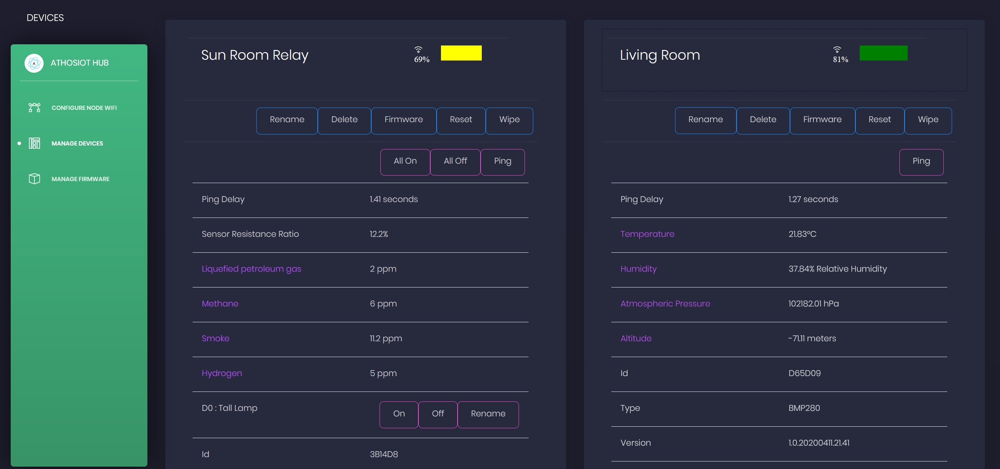

# AthosIoT – Screen Shots

The following screen shots are in desktop/full width view.  Each UI will adapt to a table and phone view accordingly.
    
    
    

Provies the administrator with the ability to easily change the default Wifi Settings for the System.  Once changed, you will need to Wipe each node you would like to use the new settings.
    
    

Provies the administrator with the ability to easily delete and upload new firmware for your network.

    
    

Provies the administrator with the ability to easily view all the nodes in the network, including the Wifi Signal strength of each node (a percentage based on RSSI).
    
    

Provies the administrator with the ability to easily view, in depth, each node in the network and the variety of sensor telemetry. We only include the *last* value for each data point.
    
    

More details on nodes with more capabilities.
    
    

Filtering of nodes is possible
    
    

From the Manage Nodes UI, this provides the administrator with the ability to choose which specific firmware to apply to that given node.  It will immediately start the OTA process and typically in about 10 seconds the node will be back online.

